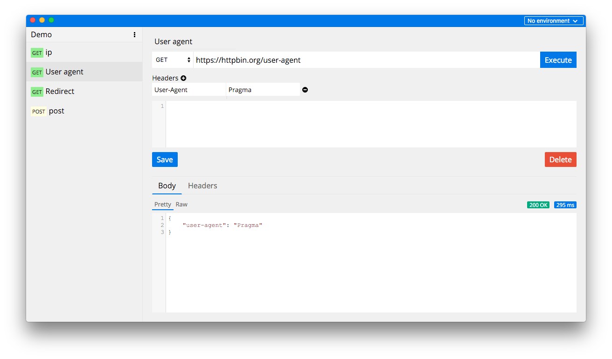

# Pragma HTTP/REST GUI client

This is my weekend hack project that I'm using to learn React and related tools.
Hopefully, in the process I can come up with a replacement for the Postman REST client.



## Getting started

```sh
npm install
```

## Run for development

Run this two commands __simultaneously__ in different console tabs.

```sh
npm run hot-server
npm run start-hot
```

## Run end-to-end tests

Build the app once

```sh
npm run build
```

or continuously to help tighten your feedback loop

```sh
npm run build:watch
```

Then run:

```sh
npm run test-e2e
```


## Package

```sh
npm run package
```

To package apps for all platforms:

```sh
npm run package-all
```
